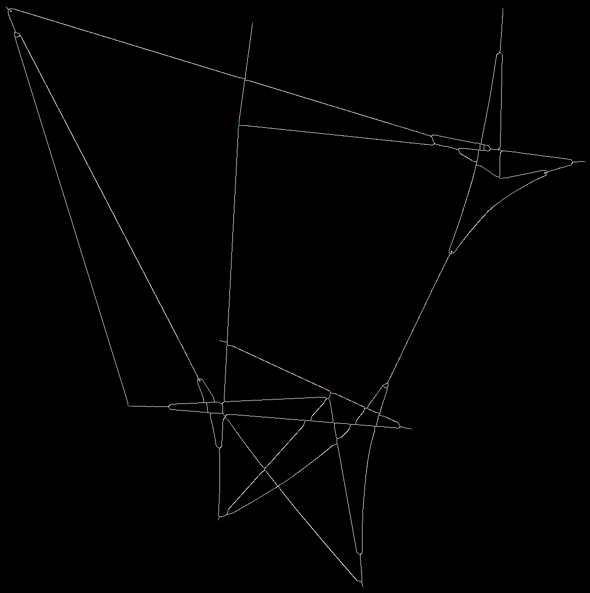

# Edge Bundling Algorithms Evaluation (WIP)

_Inspired by_ [Optical Graph Recognition](https://www.researchgate.net/publication/232651643_Optical_Graph_Recognition)

### Steps

1. Reading image using OpenCV tools
2. Image preprocessing: _opening_ + _closing_
3. Image thinning ([A Sequential Thinning Algorithm For MultiDimensional Binary Patterns](https://arxiv.org/pdf/1710.03025.pdf)) 
4. Create extended matrix for future algorithms of optical graph recognition
5. Detect vertexes from source graph
6. Detect edges (the most complex step)
7. Evaluation some metrics: crossings count, edge bends, edge lengths, ambiguity

### Dependencies

1. [OpenCV](https://opencv.org/) –– open source CV library
2. [plog](https://github.com/SergiusTheBest/plog) –– lightweight logging library

### Git submodules initialization
```
git submodule update --init --recursive
```

### Building

To build source code use cmake:
```
mkdir build && cd build && cmake .. -DCMAKE_BUILD_TYPE=Release && make
```

### Running (WIP...)
...

### Results

Below you can see visualization of algorithm implementation for finding edges from one particular vertex:


